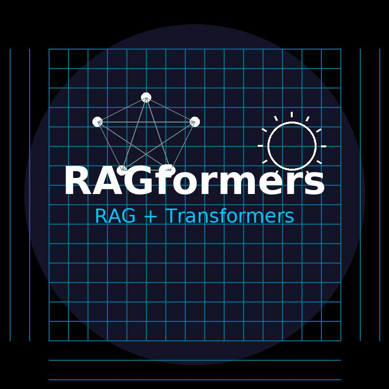
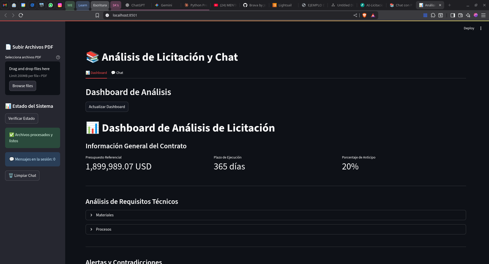
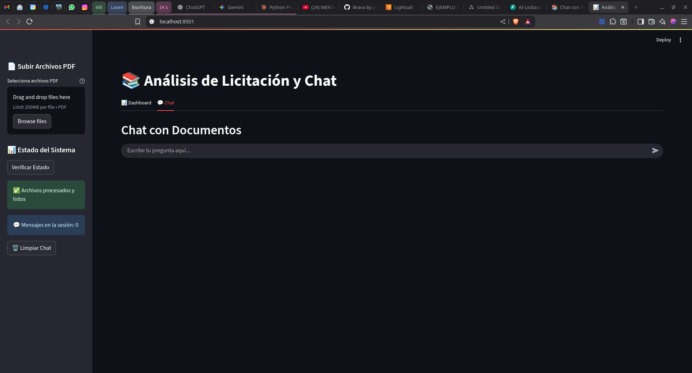

# RAGFormers 



## AI-Licitaciones: Intelligent Tender Document Analysis Platform

## 📌 Overview
**AI-Licitaciones** is an AI-powered web platform designed to automate the analysis and comparison of construction tender documents (bidding terms, proposals, and contracts).  
The system uses **OCR** and an **AI ChatBot** framework to extract, classify, validate, and highlight key legal, technical, and financial aspects, enabling faster, more accurate, and risk-aware decision-making.

## Key Features
- **OCR Processing**: Extracts text from both scanned and digital PDFs.  
- **Automatic Classification**: Separates content into legal, technical, and economic sections.  
- **Contractor Validation**: Checks RUC and legal eligibility via APIs or web scraping.  
- **Risk Detection**: Identifies missing clauses, ambiguities, and inconsistencies.  
- **Proposal Comparison**: Interactive dashboard with compliance rates, risk indicators, and visual summaries.  
- **Multi-file Upload**: Process multiple documents at once with side-by-side analysis.

## Tech Stack
- **Backend**: [FastAPI](https://fastapi.tiangolo.com/) (Python)  
- **Frontend**: [Streamlit](https://streamlit.io/)  
- **AI Chatbot**: [LangChain](https://www.langchain.com/), [LangGraph](https://www.langchain.com/langgraph)  
- **OCR**: [Docling](https://docling-project.github.io/docling/)  
- **Data Processing**: pandas, regex, requests, BeautifulSoup4  

## 📂 Project Structure
```bash

RAGFormers/
├── backend/        # FastAPI server for document processing & analysis
├── frontend/       # Streamlit dashboard
├── models/         # NLP models and rules
├── data/           # Sample documents for testing
├── README.md

```

## Installation
```bash
# Clone repository
git clone https://github.com/JorgeArguello1999/RAGFarmers.git
cd RAGFormers

# Create virtual environment
python -m venv venv
source venv/bin/activate  # Linux/macOS
venv\Scripts\activate     # Windows

# Install dependencies
pip install -r requirements.txt
````

## Usage

**Run Backend (FastAPI)**:

```bash
uvicorn backend.main:app --reload
```

**Run Frontend (Streamlit)**:

```bash
streamlit run frontend/app.py
```

Then open the provided local URL in your browser.

## Workflow

1. Upload one or multiple PDF documents (tender documents, proposals, contracts).
2. System applies OCR and extracts text in markdown format.
3. AI Chatbot framework analyses markdown files to extract and classify relevant information.
4. Validates contractor RUC via API/scraping.
5. Displays interactive comparative dashboard.

## Example Dashboard




## License

This project is licensed under the MIT License. See the [LICENSE](LICENSE.md) file for details.


**Developed by:** 

* Jorge Argüello (Full Stack Developer)
* Kuntur Muenala (AI Engineer)
* Diego Villacreses (AI Engineer)
